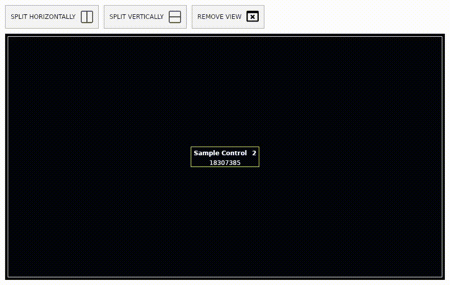

# netcore-desktop

[](https://www.nuget.org/packages/netcore-desktop/)

.NET core desktop

- [API Documentation](https://devel0.github.io/netcore-desktop/html/annotated.html)
- [Changelog](https://github.com/devel0/netcore-desktop/commits/master)

<hr/>

<!-- TOC -->
* [Examples](#examples)
    - [0001 ( TextBoxSlider )](#0001--textboxslider-)
    - [0002 ( GridSplitterManager )](#0002--gridsplittermanager-)
* [How this project was built](#how-this-project-was-built)
<!-- TOCEND -->

<hr/>

## Examples

### 0001 ( GridAutoRow )

### 0002 ( SmartConverter )

### 0003 ( GridSplitterManager )

[code](https://github.com/devel0/netcore-desktop/blob/ed1b3e8c9bea960242138a0ed183044be5e01083/examples/0002/MainWindow.xaml#L40)



## How this project was built

```sh
mkdir netcore-desktop
cd netcore-desktop

dotnet new sln

mkdir src examples

cd src
dotnet new classlib -n netcore-desktop
mv netcore-desktop desktop
cd desktop
dotnet add package netcore-ext
dotnet add package Avalonia.Desktop
cd ../..

cd examples
dotnet new avalonia.mvvm -n example
mv example/example.csproj example/example-0001.csproj
mv example example-0001
cd ..

dotnet sln add src/desktop examples/example-0001

dotnet build

# documentation css

mkdir data
git submodule add https://github.com/jothepro/doxygen-awesome-css.git data/doxygen-awesome-css
cd data/doxygen-awesome-css
# doxygen 1.9.2 ( workaround about treeview https://github.com/doxygen/doxygen/issues/9254 )
# doxygen version used https://github.com/SearchAThing-forks/doxygen/tree/Release_1_9_2_with_autotrimleft
git checkout 45f50e0438ac31ec3b3cd594ae68925fc8d4aeae
cd ../..
```

## documentation (github pages)

### build and view locally

```sh
./doc build
./doc serve
./doc view
```

### integrate

```sh
git checkout docs
git merge master --commit --no-edit
./doc build
git commit -a -m "doc"
git checkout master
```
