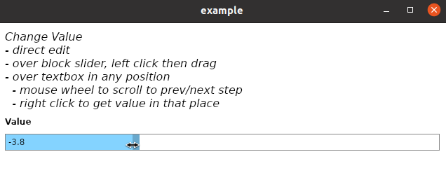

# netcore-desktop

[](https://www.nuget.org/packages/netcore-desktop/)

.NET core desktop

<hr/>

- [API Documentation](https://devel0.github.io/netcore-desktop/api/SearchAThing.html)
- [Recent changes](#recent-changes)
- [Quickstart](#quickstart)
- [Examples](#examples)
- [How this project was built](#how-this-project-was-built)

<hr/>

## Recent changes

- **0.0.2** : netcore-util 1.6.2

## Quickstart

- [nuget package](https://www.nuget.org/packages/netcore-desktop/)

in .cs file

```csharp
using SearchAThing;
```

in .xaml file specify namespace

```
xmlns:desktop="clr-namespace:SearchAThing;assembly=netcore-desktop"
```

to run examples

```sh
cd netcore-desktop
code .
```

hit F5 to start example ( change by edit [.vscode/launch.json](.vscode/launch.json) )

## Examples

#### 0001

TextBoxSlider example



#### 0002

GridSplitterManager example


## How this project was built

```sh
mkdir netcore-desktop
cd netcore-desktop

dotnet new sln
dotnet new classlib -n netcore-desktop

cd netcore-desktop
dotnet add package netcore-util --version 1.6.1
dotnet add package Avalonia --version 0.10.0-preview2
cd ..

dotnet sln add netcore-desktop
dotnet restore
dotnet build
```
